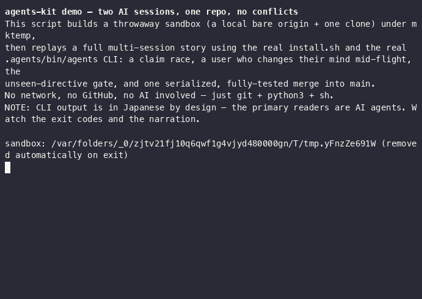
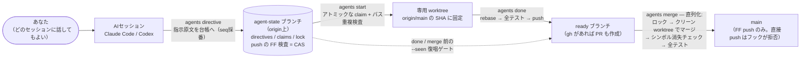

# agents-kit — 複数AIセッション並行開発キット

[](https://github.com/hiroyuki0504/agents-kit/actions/workflows/tests.yml)
[](LICENSE)
[](https://github.com/hiroyuki0504/agents-kit/releases)

English version: [README.md](README.md)



1つの Git リポジトリに対し、別々のターミナルで動く複数の AI（Claude Code / Codex 混在、モデル・effort 任意）が、あなたの随時指示を受けながら**コンフリクトを起こさず並行実装**するための調整キットです。

仕組みは git だけで完結します（AI ベンダー固有機能に依存しません）。調整情報は origin 上の専用 orphan ブランチ `agent-state` に記録され（`git push` の fast-forward 検査が compare-and-swap として働きます）、あなたの指示は全順序つきの directive として台帳に残り、矛盾したら**常に新しい指示が勝ちます**。main へのマージは直列化された `agents merge` コマンドだけが行い、1 マージごとに全テストを実行します。main への直接 push はローカルフックが物理的に拒否します。GitHub 固有機能は前提にしません（任意の git remote で動きます）。

## 8つの実敗から生まれた

本キットの各機構は、素朴なやり方が実際に壊れた経験から生まれています。以下の8件はすべてマルチAI並行開発で実際に起きた失敗で、本キットはそれぞれを「構造的に不可能」または「即停止」に変えます。

| # | 何が起きたか | 本キットはどう封じるか |
|---|---|---|
| 1 | **意味衝突**。別ファイル同士でも Git はきれいにマージするが意味が衝突する — 初期化ロジックが4通り併存してコンパイル不能、検証ロジックが打ち消し合い。21 PR 並行マージで4回発生 | マージを完全に直列化し、**1マージごとに**そのマージ結果そのものへフルビルド+全テストを実行してから push する |
| 2 | **`gh pr merge` が静かにコードを消す**。コンフリクト解決時に関数定義ごと消して成功を返した | `gh pr merge` を全面禁止。マージはクリーン worktree でローカルに実行し、シンボル消失チェックで定義が消えていないか検査し、**検証・テストしたコミットそのもの**を push する |
| 3 | **worktree 残留**。別セッションが残した未コミット1,100行が共有 worktree に残留し誤診断を招いた | マージは**毎回新規の専用 worktree**で行い、作成直後に `git status --porcelain` が空であることを強制する |
| 4 | **SHA 固定漏れ**。「今 checkout されているもの」を基点に worktree を作り、誤った状態の上に実装した | worktree は常に明示した `origin/main` の SHA から作り、その SHA を claim に `base_sha` として記録する |
| 5 | **マージ順序**。GitHub の mergeable 判定は各 PR 単独 vs main。全部 mergeable でも着地順次第で壊れた | 1本ずつマージする。マージ中に main が動いたら**新しい main に対して再マージ・再テスト**。残りのブランチは rebase + 再テストへ戻す |
| 6 | **ブランチ削除ハザード**。マージ直後にブランチを消し、マージ未確定のまま PR が取り残された | 削除はマージコミットが `origin/main` の祖先になったことを確認した後のみ。しかも検証時の tip に固定した `--force-with-lease` で行う |
| 7 | **積み PR の base 罠**。base ブランチを消すと子 PR が静かに迷子になる。gh は成功を返し続けた | 積み PR を構造的に不可能化: `agents start` は base 指定を受け付けず常に `origin/main` SHA 起点。`done` は既存 PR の base を検証・矯正する |
| 8 | **rebase 後の未テスト push**（4回踏んだ） | `agents done` が rebase → 全テスト → push の順序を固定。テスト失敗なら push されず、省略フラグは存在しない |

## 仕組み



- **素の git ブランチの上の CAS**。状態変更は必ず「`agent-state` へ commit → push」。push は fast-forward 必須なので git 自体が compare-and-swap になります。push 拒否は「他セッションが先に状態を変えた」という正常イベントで、fetch → 前提再評価 → リトライで解決します。サーバも常駐プロセスもロックファイルも不要です。
- **時計を使わない後勝ち全順序**。`agent-state` の歴史は一直線で、そのコミット順が全順序です。各 directive はそこから整数 seq を得て、矛盾したら seq 最大が正。時刻は順序判定に一切使いません（TTL の鮮度判定のみ）。
- **`--seen` 復唱ゲート**。未読の directive が残っている限り `done` と `merge` は拒否されます。表示された最大 seq を `--seen d00047` の形で復唱しないと進めません — 出力を読まないと書けない値であり、読み飛ばしを構造的に防ぎます。復唱の事実は台帳に記録されます。
- **merge 一本道**。main を進められるのは `agents merge` だけです: グローバルロック取得 → クリーン worktree でマージ＝シミュレーション → シンボル消失チェック → マージ結果そのものに全テスト → 検証したコミットを FF push。途中で main が動いていたら新しい main に対して再走します。
- **pre-push フックが物理防壁**。main / agent-state への直接 push はローカルの pre-push フックが拒否します（実効フックパスに設置。`core.hooksPath` 対応）。ロックは最適化にすぎず、安全の本体は最終 push の FF 検査です。

自動テストに加え、実 GitHub リポジトリ上で3つの AI セッション（モデル・effort 混在）による並行実証を行い、9つの成功基準すべて PASS・プロトコル違反ゼロを確認済みです（記録は [PROGRESS.md](PROGRESS.md)）。

## 動作環境

- git 2.30+ / python3 3.9+（標準ライブラリのみ）/ POSIX sh + bash（macOS 標準の bash 3.2 で動作確認済み）
- 任意: `gh`（GitHub CLI）— ある場合のみ `done` が PR を自動作成します（無くても全機能動作）
- CI: ubuntu-latest / macos-latest で `tests/smoke.sh`（33検査）+ `tests/breaker.sh`（14検査）+ `tests/uninstall.sh`（32検査）+ `demo.sh` を実行

## 導入（リポジトリごとに1回）

```sh
git clone https://github.com/hiroyuki0504/agents-kit.git
cd agents-kit
./install.sh /path/to/your-repo
```

push 前に何が入るか確認したい場合は `./install.sh /path/to/your-repo --no-push`（origin への自動 push を保留します。内容を確認したら `--no-push` 無しで再実行すると push されます）。

これで対象リポジトリに以下が入ります。

- `.agents/bin/agents` — 調整 CLI（python3 標準ライブラリのみ）
- `.agents/PROTOCOL.md` — AI が読んで従う規約
- `.agents/config.json` — このクローン専用の設定（コミットされない）
- `AGENTS.md` / `CLAUDE.md` — AI への案内ブロック（既存ファイルには追記）
- pre-push フック — main / agent-state への直接 push を拒否
- origin に `agent-state` ブランチと、main に `.agents` 一式（自動 push）

導入後に1つだけ手作業: `.agents/config.json` の `test_cmd` にテストコマンドを書いてください（例 `"pytest -q"`。テストが無いリポジトリは `"true"` と明示）。これを書くまで done / merge は動きません。書いたら repo ルートで一度 `sh -c '<test_cmd>'` を実行し、**main の時点で素で通る**ことを確認してください（通らない test_cmd は全セッションの done / merge を止めます）。言語の生成物（`__pycache__` 等）は repo の `.gitignore` に入れておいてください（worktree に残ると done が停止します）。

導入クローンの checkout は install.sh が自動で main 最新に追いつかせます（追跡ファイルに未コミット変更がある場合などは案内だけ出して触りません）。

## 60秒で試す（AI不要）

```sh
bash demo.sh
```

`demo.sh` はローカルの一時ディレクトリに使い捨ての砂場（bare origin + 作業クローン）を作り、調整プロトコルを自動で実演・検証します: 2セッションが同じ claim を奪い合い勝者はちょうど1人になること、後から出した指示が前の指示を上書きすること（後勝ち）、未読 directive がある間は `--seen` ゲートが done / merge を止めること、マージが厳密に1本ずつ直列化されること。ネットワーク・GitHub アカウント・AI は一切不要です。

## 事前診断（doctor）

```sh
.agents/bin/agents doctor              # read-only の健全性検査
.agents/bin/agents doctor --run-tests  # 加えて test_cmd を1回実走
```

`doctor` は導入済みリポジトリを何も変更せずに検査します: git / python のバージョン、origin への到達性、`agent-state` ブランチの存在、`test_cmd` の設定、実効フックパスへのフック設置、本キットと非互換な branch protection（Require PR 系）の検出。

## 日常の使い方

複数ターミナルでそれぞれ Claude Code / Codex を開き、**各セッションに最初にこう言うだけ**です。

> .agents/PROTOCOL.md を読んで従って。

あとは普通に指示してください（「ログイン画面作って」「あ、やっぱりボタンは赤で」）。AI 側がプロトコルに従い、

1. あなたの指示原文を `agents directive` で台帳に記録し、
2. `agents start` で担当を宣言して専用 worktree を作り、
3. 実装して `agents done`（rebase → 全テスト → push）、
4. `agents merge` で直列マージ（マージ結果ごとに全テスト）

という流れを自動で回します。担当の重複・指示の矛盾（後の指示が勝ち）・マージ順は AI 同士がスクリプト経由で調整します。

あなたが状況を見たいときは、リポジトリ内でそのまま:

```sh
.agents/bin/agents sync     # 最新を取得して全体表示（担当・指示・ロック・警告）
.agents/bin/agents status   # オフライン表示のみ
```

過去に起きたことは全て台帳に残っています:

```sh
git log --oneline --stat refs/remotes/origin/agent-state   # 完全な監査ログ
git show <sha>:claims/login-ui.json                        # 任意時点の状態
```

誰がいつ何を宣言し、どのマージがどのテストを走らせ、誰がどの指示を ack したか — 状態変更は1件1コミットで、メッセージ（`directive d00043` / `claim login-ui` / `ready` / `seen` / `lock merge` / `merge-log` / `release` / `evict`）だけで流れが読めます。

## config.json の設定

`.agents/config.json`（クローンローカル。コミットされません。別クローンでは install.sh を再実行して再設定）:

| キー | 既定値 | 意味 |
|---|---|---|
| `test_cmd` | null | **必須設定**。worktree ルートで `sh -c` 実行される全テスト。無しなら `"true"` |
| `build_cmd` | null | テスト前に走らせるビルド（任意） |
| `remote` | `"origin"` | 調整に使う remote |
| `main_branch` | 検出値 | install.sh が既定ブランチを自動検出して書き込む |
| `state_branch` | `"agent-state"` | 調整用ブランチ名 |
| `worktree_root` | `".worktrees"` | worktree の置き場（repo 内） |
| `claim_ttl_hours` | 24 | 担当宣言の生存時間（切れると evict 可能に） |
| `merge_lock_ttl_min` | 30 | merge ロックの生存時間。**フルテスト所要時間の2倍以上に** |
| `pr` | `"auto"` | gh がある GitHub repo でのみ done が PR を作る。`"off"` で無効 |

変更は次の `agents sync` から全セッションに即時に効きます。

## トラブル時の見方

- **完全な監査ログ**: `git log --oneline --stat refs/remotes/origin/agent-state`。誰がいつ何を宣言・マージ・解除したかが全部残っています。任意時点の中身は `git show <sha>:claims/xxx.json`。
- **AI が「push を拒否された」と言う**: 正常です。main へは `agents merge` だけが入れられます。AI が回避策（`--no-verify` 等）を口にしたら禁止と伝えてください。
- **担当が残ったまま AI が死んだ**: どのセッションでも `agents evict --dry-run` で確認 → `agents evict`。worktree とブランチは消されず残るので、未 push の作業を確認してから片付けます。
- **merge ロックが残った**: `agents sync` で STALE 表示が出ていれば `agents evict --lock-only`。出ていなければ誰かのテストが走っているだけなので待ちます。
- **exit code 8 を見た**: そのセッションの担当が失効した合図。AI は作業を止めて `.agents/PROTOCOL.md` のプレイブックに従います。
- **`.worktrees/` にゴミが溜まった**: `agents sync` が「孤児」として列挙します。中身（未 push 作業）を確認してから `git worktree remove` してください。

## GitHub 推奨設定

main と agent-state に対し、branch protection で有効化するのは**「force push 禁止」（Allow force pushes をオフ）と「削除禁止」（Allow deletions をオフ）の2つだけ**です。**Require a pull request before merging 系は設定しないでください**（`agents merge` の直接 push と非互換でツールが自壊します。どうしても設定する場合はユーザー自身を bypass に入れてください）。

## アンインストール

```sh
./uninstall.sh /path/to/repo
```

フック・`AGENTS.md` / `CLAUDE.md` のマーカーブロック・`.agents` 一式を撤去し、main に除去コミットを push します。origin 上の `agent-state` 台帳は監査証跡として既定で残します（`--purge-remote` で削除）。

## FAQ

**CLI の出力が日本語なのはなぜ?**
主読者は AI エージェント自身です — `PROTOCOL.md` と CLI の全メッセージは AI が読む前提で書かれており、現行のコーディング AI は日本語をネイティブに扱います。人間のオペレーターに必要な情報は README（本書と英語版）で完結します。英語メッセージカタログは計画中です。

**なぜ `gh pr merge` や GitHub の merge queue を使わない?**
上の実敗 2・5・7 のとおりです（全て実話）: `gh pr merge` はコンフリクト解決時に静かにコードを消したことがあり、GitHub の mergeable 判定は各 PR 単独 vs main なので全部緑でも着地順で壊れ、積み PR の base は静かに消えます。本キットはクリーン worktree でローカルにマージし、push する予定のコミットそのものを検証・テストしてから、そのコミットを push します。merge queue はプラン依存かつ GitHub 限定の機能であり、本キットは任意の git remote で動くことを選んでいます。

**GitHub は必須?**
不要です。調整は素の git であり、任意の remote で動きます — ローカルの bare ディレクトリでも構いません（remote が無い repo では install.sh が作成レシピを1行表示します）。gh がある GitHub repo では `done` がレビュー可視化のために PR も作成しますが、マージが PR を経由することはありません。

**セッションが死んだら?**
claim には TTL があります（既定 24 時間。worktree 内の `agents sync` が自動延命）。失効後はどのセッションからでも `agents evict`（まず `--dry-run` で確認）で掃除し、担当を引き継げます。死んだセッションの worktree とブランチはディスクに残り、未 push の作業が自動で消されることはありません。「死んだはず」のセッションが戻ってきた場合、次のコマンドが exit code 8（停止シグナル）になり、新しい claim を壊すことはありません。merge ロックには別の短い TTL があります（`agents evict --lock-only`）。

**Windows は?**
未検証です。対象は macOS / Linux（POSIX sh + bash + python3）で、CI は両 OS（ubuntu-latest / macos-latest）で全テストを実行しています。報告・パッチ歓迎です。

## 開発リポジトリ構成（このディレクトリ）

- `kit/agents` / `kit/PROTOCOL.md` — 配布物本体（調整 CLI + AI が従う規約）
- `install.sh` — 導入スクリプト（冪等。再実行で kit を更新配布）、`uninstall.sh` — 撤去スクリプト、`demo.sh` — 自動検証つきローカルデモ
- `tests/smoke.sh` / `tests/breaker.sh` / `tests/uninstall.sh` — ローカル bare origin を使った自動検証（`bash tests/smoke.sh && bash tests/breaker.sh && bash tests/uninstall.sh`）
- `SPEC.md` / `BRIEF.md` — 仕様と設計入力
- `.github/workflows/tests.yml` — CI（ubuntu / macos で全テスト）

コントリビューションは [CONTRIBUTING.md](CONTRIBUTING.md) を参照してください。

## ライセンス / License

MIT — [LICENSE](LICENSE) を参照。
