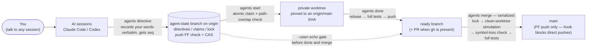

# agents-kit

[](https://github.com/hiroyuki0504/agents-kit/actions/workflows/tests.yml)
[](LICENSE)
[](https://github.com/hiroyuki0504/agents-kit/releases)

日本語版: [README.ja.md](README.ja.md)


Run multiple AI coding sessions — Claude Code and Codex side by side, any mix of models and effort levels — against **one Git repository, in parallel, without conflicts**, while you keep giving instructions to whichever session you like.

Coordination is plain git, end to end: an orphan `agent-state` branch on origin is the shared ledger (the fast-forward check of `git push` doubles as compare-and-swap), your instructions become totally-ordered directives where **the newest one wins**, and main only ever moves through a single serialized merge path that runs the full test suite per merge. No AI-vendor features, no required GitHub services — any git remote works.

*The AI-facing protocol and CLI messages are in Japanese — the AIs read them natively. This README covers everything a human operator needs; see the [FAQ](#faq).*

## Born from 8 real failures

Every mechanism in this kit exists because the naive approach actually broke. All eight failures below happened during real multi-AI parallel development; the kit turns each one into a structural impossibility or a hard stop.

| # | What happened | How agents-kit closes it |
|---|---|---|
| 1 | **Semantic conflict.** Git merged disjoint files cleanly, but the meanings collided — four coexisting init paths made the build uncompilable, validation logic cancelled itself out. Happened 4 times across 21 parallel PRs | Merges are fully serialized, and the full build + test suite runs on **every single merge result** before it is pushed |
| 2 | **`gh pr merge` silently dropped code.** Conflict resolution deleted an entire function definition and still reported success | `gh pr merge` is banned outright. The merge is performed locally in a clean worktree, a symbol-loss check verifies no definitions vanished, and the **exact commit that was verified and tested** is what gets pushed |
| 3 | **Worktree leftovers.** 1,100 uncommitted lines left behind by another session in a shared worktree led to misdiagnosis | Every merge runs in a **fresh, dedicated worktree**, and `git status --porcelain` must come back empty right after it is created |
| 4 | **Unpinned worktree base.** Worktrees created from "whatever is checked out right now" built on the wrong state | Worktrees are always created from an explicitly named `origin/main` SHA, recorded in the claim as `base_sha` |
| 5 | **Merge order.** GitHub's mergeable flag checks each PR against main in isolation; a set of all-green PRs still broke depending on landing order | Branches merge **one at a time**. If main moves mid-merge, the merge re-runs — re-simulated and re-tested against the new main; remaining branches go back through rebase + tests |
| 6 | **Branch-deletion hazard.** Deleting a branch right after merging left a PR stranded with its merge not actually landed | Deletion happens only after the merge commit is confirmed to be an ancestor of `origin/main`, and uses `--force-with-lease` pinned to the verified tip |
| 7 | **Stacked-PR trap.** Deleting a base branch quietly orphaned its child PRs — `gh` kept reporting success | Stacked PRs are structurally impossible: `agents start` accepts no base and always branches from the `origin/main` SHA, and `done` verifies (and corrects) the base of existing PRs |
| 8 | **Untested push after a rebase.** Rebased, pushed without re-running tests — broke the build 4 times | `agents done` hard-codes the order **rebase → full tests → push**. A test failure means nothing is pushed, and no skip flag exists |

## How it works



- **CAS on a plain git branch.** Every state change is "commit to `agent-state`, then push". The push is fast-forward-only, so git itself is the compare-and-swap: a rejected push just means another session changed the state first — fetch, re-evaluate, retry. No server, no daemon, no lock files.
- **Last-instruction-wins, without clocks.** The history of `agent-state` is linear, and its commit order is the total order; each directive gets an integer `seq` from it. When instructions contradict each other, the highest seq wins. Wall-clock time is never used for ordering — only for TTL staleness.
- **The `--seen` echo gate.** While directives newer than a session's last acknowledgment exist, `done` and `merge` refuse to run: the session must read them and echo the highest seq back (`--seen d00047`). The value cannot be produced without reading the output, and the acknowledgment is recorded in the ledger.
- **One merge path, fully serialized.** Only `agents merge` can advance main: take the global merge lock → simulate the merge in a fresh clean worktree → check that no symbols silently vanished → run the full test suite on the exact merge commit → fast-forward push that same commit. If main moved in the meantime, re-merge and re-test against the new main.
- **A pre-push hook as the physical barrier.** Direct pushes to main and agent-state are rejected locally (the hook is installed at the effective hooks path; `core.hooksPath` is respected). The merge lock is an optimization — the safety comes from the FF check on the final push.

Beyond the automated suites, v1 was exercised end-to-end on a real GitHub repository with three AI sessions in parallel (different models and effort levels): all nine success criteria passed with zero protocol violations. The run record is in [PROGRESS.md](PROGRESS.md) (in Japanese; the failure table above is its English distillation).

## Quick start

**Requirements**: git 2.30+ · python3 3.9+ (standard library only) · POSIX sh + bash (macOS's stock bash 3.2 works). Optional: `gh` (GitHub CLI) — when present, `done` also opens PRs; everything works without it.

```sh
git clone https://github.com/hiroyuki0504/agents-kit.git
cd agents-kit
./install.sh /path/to/your-repo
```

This installs into the target repo: the coordination CLI (`.agents/bin/agents`, python3 stdlib only), the protocol the AIs follow (`.agents/PROTOCOL.md`), a clone-local `.agents/config.json` (never committed), pointer blocks in `AGENTS.md` / `CLAUDE.md` (appended to existing files, created otherwise), a pre-push hook that rejects direct pushes to main / agent-state, and — pushed automatically — the `agent-state` branch on origin plus the `.agents` payload on main. The installer is idempotent; rerun it to roll out kit updates. It also fast-forwards the install clone's checkout to the new main when that is safe (with uncommitted changes to tracked files it only prints guidance and touches nothing). To review everything before it reaches origin: `./install.sh /path/to/your-repo --no-push`, then rerun without the flag to push.

**One manual step** — open `/path/to/your-repo/.agents/config.json` (the installer wrote it, with `main_branch` already detected) and set the `test_cmd` key, keeping the rest of the file as is:

```json
"test_cmd": "pytest -q"
```

`test_cmd` is required — `done` and `merge` refuse to run until it is set. If the repo has no tests, state that explicitly with `"test_cmd": "true"`. Run the command once at the repo root and confirm it passes on plain main (a failing `test_cmd` blocks done/merge for **every** session), and make sure build artifacts (`__pycache__` and friends) are in the repo's `.gitignore` — leftovers in a worktree stop `done`.

**Then start working** — open one terminal per AI session and tell each one:

> Read .agents/PROTOCOL.md and follow it.

That's all. Keep instructing the sessions in plain language ("build the login screen", "actually, make the button red"). Following the protocol, each AI records your words in the ledger (`agents directive`), claims a scope and gets its own worktree (`agents start`), implements, runs `agents done` (rebase → full tests → push), and lands the result with `agents merge` (serialized, tested per merge). Overlapping claims, contradicting instructions (newest wins) and merge order are negotiated between the AIs through the script.

## Try it in 60 seconds (no AI needed)

```sh
bash demo.sh
```

`demo.sh` builds a throwaway sandbox in a local temp directory — a bare origin plus working clones — then plays the coordination protocol against itself and verifies the outcome automatically: two sessions race for the same claim and exactly one wins; a later directive overrides an earlier one (last-wins); the `--seen` gate stops done/merge until the new directive is acknowledged; merges land strictly one at a time. No network, no GitHub account, no AI sessions involved.

## Preflight

```sh
.agents/bin/agents doctor              # read-only health check
.agents/bin/agents doctor --run-tests  # additionally runs test_cmd once
```

`doctor` inspects an installed repo without changing anything: git/python versions, origin reachability, presence of the `agent-state` branch, `test_cmd` configuration, hook installation at the effective hooks path, and branch-protection settings that are incompatible with the kit (Require-PR rules).

## Day-to-day

Watching what the sessions are doing:

```sh
.agents/bin/agents sync     # fetch + full picture: main, claims, directives, lock, warnings
.agents/bin/agents status   # same view, offline (no fetch)
```

Everything that ever happened is in the ledger:

```sh
git log --oneline --stat refs/remotes/origin/agent-state   # complete audit log
git show <sha>:claims/login-ui.json                        # any state at any point in time
```

Who claimed what and when, which merge ran which tests, who acknowledged which directive — every state change is one commit with a readable message (`directive d00043` / `claim login-ui` / `ready` / `seen` / `lock merge` / `merge-log` / `release` / `evict`).

## Configuration

`.agents/config.json` is clone-local — it is never committed. On another clone, rerun `install.sh` and set `test_cmd` again.

| Key | Default | Meaning |
|---|---|---|
| `test_cmd` | null | **Required.** Full test suite, run with `sh -c` at the worktree root. Use `"true"` if the repo has no tests |
| `build_cmd` | null | Optional build step, run before tests |
| `remote` | `"origin"` | Remote used for coordination |
| `main_branch` | auto-detected | install.sh detects the default branch and writes it here |
| `state_branch` | `"agent-state"` | Name of the coordination branch |
| `worktree_root` | `".worktrees"` | Where worktrees live (inside the repo) |
| `claim_ttl_hours` | 24 | Claim lifetime; expired claims become evictable |
| `merge_lock_ttl_min` | 30 | Merge-lock lifetime. **Set it to at least 2× your full test time** |
| `pr` | `"auto"` | `done` creates a PR only on a GitHub repo with `gh` installed. `"off"` disables |

Changes take effect for every session from the next `agents sync`.

## Troubleshooting

- **Complete audit log**: `git log --oneline --stat refs/remotes/origin/agent-state` shows who declared, merged and released what, and when. Read any file at any point in time with `git show <sha>:claims/xxx.json`.
- **An AI reports "push was rejected"**: working as intended. Only `agents merge` can advance main. If the AI starts talking about workarounds (`--no-verify` and the like), tell it those are forbidden.
- **An AI died with its claim still held**: from any session, `agents evict --dry-run` to inspect, then `agents evict`. The worktree and branch are kept — check for unpushed work before cleaning them up.
- **A merge lock is stuck**: if `agents sync` marks it STALE, run `agents evict --lock-only`. If it is not stale, someone's tests are still running — wait.
- **You saw exit code 8**: that session's claim is gone (evicted or re-claimed). The AI must stop and follow the playbook in `.agents/PROTOCOL.md`.
- **Junk piling up in `.worktrees/`**: `agents sync` lists them as orphans. Check the contents (unpushed work) before `git worktree remove`.

## Recommended GitHub settings

On both `main` and `agent-state`, enable exactly two branch-protection rules: **disallow force pushes** ("Allow force pushes" off) and **disallow deletions** ("Allow deletions" off). Do **not** enable "Require a pull request before merging" or similar — it is incompatible with the direct fast-forward push that `agents merge` performs, and the kit would block itself. If your organization forces it, add yourself to the bypass list.

## Uninstall

```sh
./uninstall.sh /path/to/repo
```

Removes the hook block, the pointer blocks in `AGENTS.md` / `CLAUDE.md`, and the `.agents` directory, then pushes a removal commit to main. The `agent-state` ledger on origin is kept by default as an audit trail; pass `--purge-remote` to delete it as well.

## FAQ

**Why is the CLI output in Japanese?**
The kit's primary readers are the AI agents themselves — `PROTOCOL.md` and every CLI message are written for them, and current coding agents handle Japanese natively. Everything a human operator needs is in this README. An English message catalog is planned.

**Why not `gh pr merge` or GitHub's merge queue?**
Failures 2, 5 and 7 above, all real: `gh pr merge` silently deleted code during conflict resolution; GitHub's mergeable flag evaluates each PR against main in isolation, so all-green PRs still break depending on landing order; and stacked-PR bases disappear silently. agents-kit instead merges locally in a clean worktree, verifies and tests the exact commit it is about to push, and pushes that commit. Merge queues are also plan-dependent and GitHub-only; the kit deliberately works with any git remote.

**Does it need GitHub?**
No. Coordination is plain git and works with any remote — including a local bare directory (if the repo has no remote, `install.sh` prints a one-line recipe for creating one). On a GitHub repo with `gh` installed, `done` additionally opens PRs for review visibility; merging never goes through them.

**What if a session dies?**
Claims carry a TTL (default 24 h, refreshed automatically by `agents sync` inside the worktree). After expiry, any session can run `agents evict` (inspect first with `--dry-run`) and take over the scope. The dead session's worktree and branch are left on disk — nothing unpushed is ever deleted automatically. If the "dead" session comes back, its next command exits with code 8 (a stop signal) instead of corrupting the new claim. Merge locks have their own short TTL (`agents evict --lock-only`).

**Windows?**
Untested. The kit targets macOS and Linux (POSIX sh + bash + python3); CI runs the full test suites on both (ubuntu-latest, macos-latest). Reports and patches welcome.

## Development

Layout of this repository:

- `kit/agents`, `kit/PROTOCOL.md` — the distributed payload (coordination CLI + the protocol the AIs follow)
- `install.sh` — installer (idempotent; rerun to roll out kit updates), `uninstall.sh` — remover, `demo.sh` — self-verifying local demo
- `tests/smoke.sh`, `tests/breaker.sh`, `tests/uninstall.sh` — end-to-end, adversarial, and uninstall suites against a local bare origin (no network, no gh)
- `SPEC.md` — the full v1 specification; `BRIEF.md` — the design input, including the eight failures
- `.github/workflows/tests.yml` — CI: all three suites plus `demo.sh` on ubuntu-latest and macos-latest

Run the tests:

```sh
bash tests/smoke.sh && bash tests/breaker.sh && bash tests/uninstall.sh   # 33 + 14 + 32 checks, all local
bash demo.sh                                   # the full coordination story, self-verified
```

Contributions welcome — see [CONTRIBUTING.md](CONTRIBUTING.md).

## License

MIT — see [LICENSE](LICENSE).
